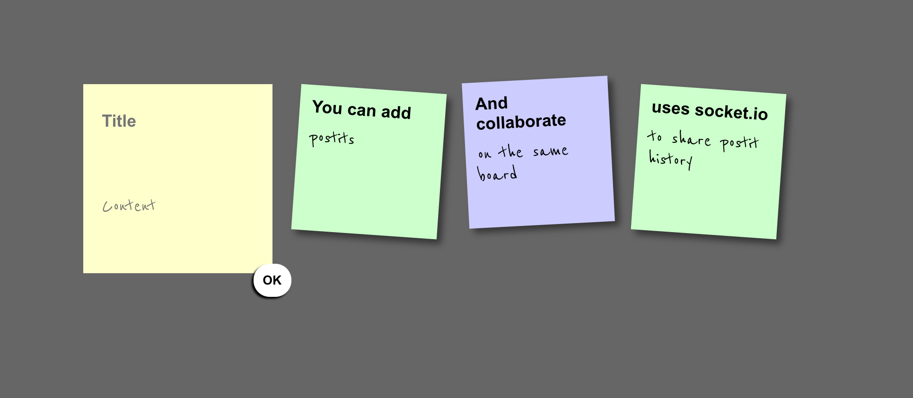

# Postit Dashboard

> A collaborative postit dashboard using websockets

[](https://hub.docker.com/r/louisguitton/postit-dashboard)

This was built during the [Challenge Fulstack JS Hackathon](http://challengefullstackjs.bemyapp.com) at Ecole42 on Jan 23rd, 2016. The winning team was getting 1500€. We did not win 😂. The task was to build a fullstack JS app in 3 hours.



## Usage

```sh
npm install
node server.js
open http://localhost:8080
```

or

```sh
docker build -t postit
docker run -it -p 8080:8080 postit
```

or from [Docker Hub](https://hub.docker.com/r/louisguitton/postit-dashboard)

```sh
docker pull louisguitton/postit-dashboard
docker run -it -p 8080:8080 louisguitton/postit-dashboard
```
